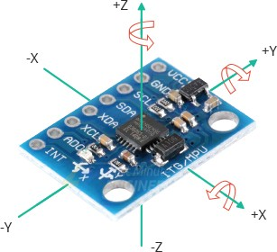
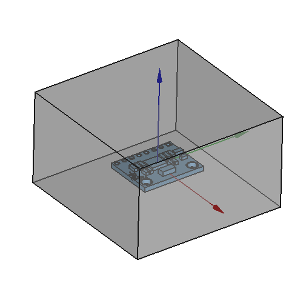
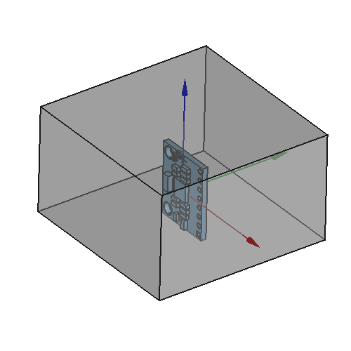
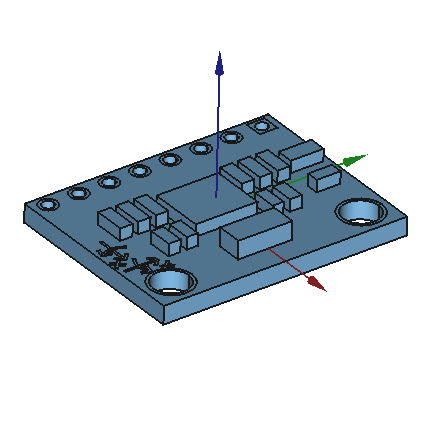
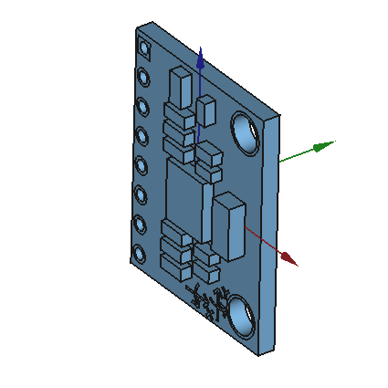
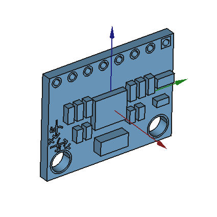
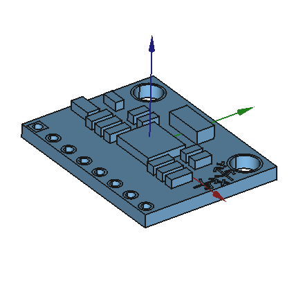
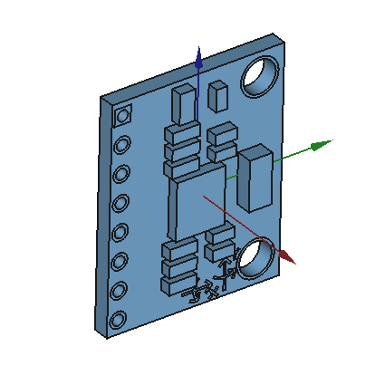
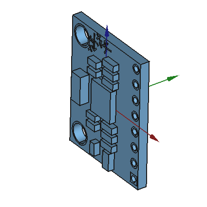

# mpu6050_ros

ROS node for MPU6050.

Supported devices:
- [x] Raspberry Pi 4

## Dependencies
- [MPU6050PI](https://github.com/tandukion/MPU6050Pi)
<br>MPU6050 library for Raspberry Pi. Please install it after building.

<br>

## Features
### IMU Data Publisher
Node `mpu6050_ros_node` will publish the IMU data on `imu_data` ([sensor_msgs/Imu](http://docs.ros.org/en/api/sensor_msgs/html/msg/Imu.html)) ROS Topic.

The published data will be based on the following processing.
  - Built-in Complementary Filter (default)
  <br> By default, the publised `imu_data` will contain raw gyro and accel data, with addition of processed quaternion calculated using complementary filter.
  - DMP (Digital Motion Processing)
  <br>The publised `imu_data` will contain data based on DMP FIFO buffer.
  <br>(Currently there is no post-processing from FIFO buffer)

<br>

### MPU6050 Coordinate Frame Transformation
Using this package, it is possible to use MPU6050 not with the default axes orientation.

Normally, MPU6050 usage has limitation that the orientation of MPU6050 needs to be the same with the default orientation of its axes.



However, there may be a case where the placement orientation of MP6050 needs to be changed due to the robot design as shown below. (Note: the gray box shows the rigid (robot) body in which MPU6050 is used to measure the inertia.)

<table>
  <tr>
    <th>
      MPU6050 with default orientation
    </th>
    <th>
      MPU6050 with rotated orientation
    </th>
  </tr>
  <tr>
    <td>
       
    </td>
    <td>
      
    </td>
  </tr>
</table>

The packages enable to change the MPU axes in the body by creating the Rotation Matrix of the MPU6050 orientation. As it is default to determine the rotation matrix by hand (even more difficult in quaternion), this package provides a simple interface using ROS parameter which lists the rotation applied to the MPU6050.

#### Creating rotation list on ROS parameter
You can also use a YAML file to be loaded on roslaunch. An example is privded on `config/config.yaml`.
<br> Format:
```
rotation:
  -
    axis: 'x'   # Name of the axis in lower script
    angle: 0    # Rotation angle in degrees
  -
    axis: 'y'
    angle: 0
```

>> Please note that you need to list the rotation applied on an axis one by one. Order is important!
<br>The rotation is based on the body coordinate frame (or world if you want), NOT the MPU6050 coordinate frame.

<table>
  <tr>
    <th>
      MPU6050 orientation
    </th>
    <th>
      Applied rotation
    </th>
    <th>
      config.yaml
    </th>
  </tr>
  <tr>
    <td>
       
    </td>
    <td>
      No rotation 
    </td>
    <td> 
      <pre>
rotation:
  -
    axis: 'x'
    angle: 0
      </pre>
    </td>
  </tr>
  <tr>
    <td>
       
    </td>
    <td>
      Rotation on X, -90 degrees  
    </td>
    <td> 
      <pre>
rotation:
  -
    axis: 'x'
    angle: -90
      </pre>
    </td>
  </tr>
  <tr>
    <td>
       
    </td>
    <td>
      Rotation on Y, -90 degrees 
    </td>
    <td> 
      <pre>
rotation:
  -
    axis: 'y'
    angle: -90
      </pre>
    </td>
  </tr>
  <tr>
    <td>
       
    </td>
    <td>
      Rotation on Z, 90 degrees 
    </td>
    <td> 
      <pre>
rotation:
  -
    axis: 'z'
    angle: 90
      </pre>
    </td>
  </tr>
  <tr>
    <td>
       
    </td>
    <td>
      Rotation on X, -90 degrees
      <br>Rotation on Z, 90 degrees
    </td>
    <td> 
      <pre>
rotation:
  -
    axis: 'x'
    angle: -90
  -
    axis: 'z'
    angle: 90
      </pre>
    </td>
  </tr>
  <tr>
    <td>
       
    </td>
    <td>
      Rotation on Z, 180 degrees
      <br>Rotation on X, 90 degrees
    </td>
    <td> 
      <pre>
rotation:
  -
    axis: 'z'
    angle: 180
  -
    axis: 'x'
    angle: 90
      </pre>
    </td>
  </tr>
</table>
